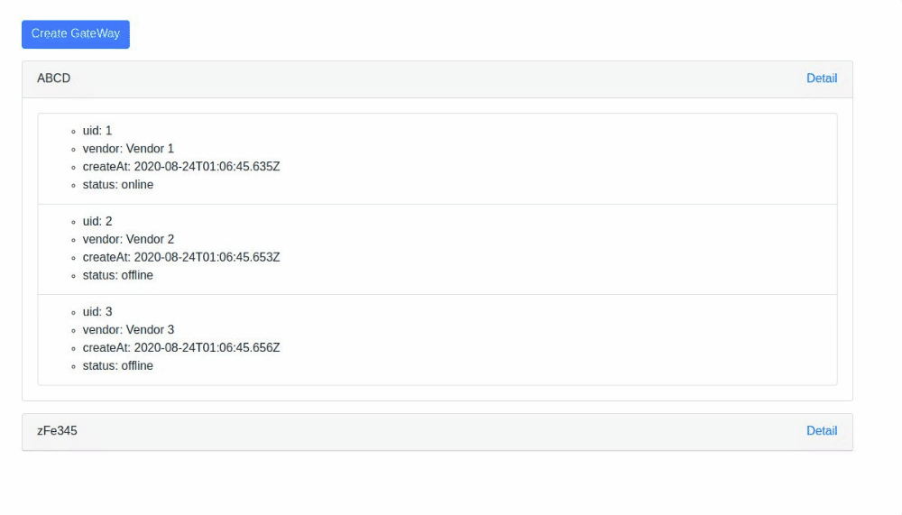

# Gateway Manager

## Prerequisites

To have installed:

- Nodejs
  ```
  https://nodejs.org/en/download/
  ```
- Mongodb

  ```
  https://docs.mongodb.com/manual/installation/
  ```

## Run locally

Executed each application (client, server) using the Readme files inside these.

## Automated deploy using Docker

Have docker and docker-compose in your computer

```
https://docs.docker.com/compose/install/
```

```
docker-compose up --build

Navigate to http://localhost:3001

Navigate to http://localhost:3000/api-docs

```

Demo UI (http://localhost:3001)



API Contract (http://localhost:3000/api-docs)


